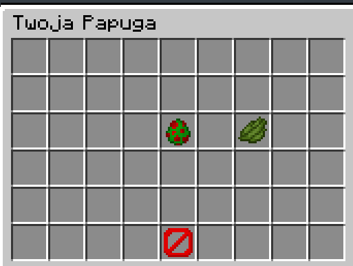

<!-- LICZNIK ODWIEDZIN -->

  

<!-- TYTUŁ -->
<h1>Cześć, jestem Majzoq! 👋</h1>
<h3>Minecraft Plugin Developer</h3>

 

<!-- ODZNAKI W STYLU ZE SCREENA -->

 

 

  

Tworzę autorskie pluginy i systemy serwerowe do Minecraft.

<!-- TECHNOLOGIE -->
<h2>Technologie</h2>

  

<!-- O MNIE -->
<h2> O mnie</h2>

Programuję pluginy do Minecrafta, boty i backend dla serwerów. Lubię pisać czysty kod, w którym łatwo się potem połapać – dzięki temu projekty można bez problemu rozwijać w przyszłości. Nie chodzi mi tylko o to, żeby coś działało „na już”, ale żeby system był stabilny i nie sypał błędami przy większej liczbie graczy. Robię rzeczy tak, żeby po prostu dobrze działały

<b>Posiadam doświadczenie w tworzeniu:</b>

<ul>
  <li> Rozbudowanych systemów ekonomii</li>
  <li> Botów Discord</li>
  <li> Integracji między serwerami</li>
</ul>

 

<!-- PROJEKTY -->
<h2>🚀 Moje Projekty</h2>

  <table>
    <tr>
      <td align="center">
         
        <b>Ulepszenia</b>
      </td>
      <td align="center">
         
        <b>Papuga</b>
