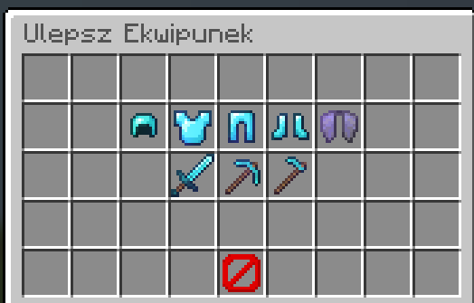

  

  <!-- TYTUŁ -->
  <h1>Cześć, jestem Majzoq! 👋</h1>
  <h3>Minecraft Plugin Developer</h3>

  <!-- ODZNAKI -->
  
  
  
    
  
  
Tworzę autorskie pluginy i systemy serwerowe do Minecraft.

  <!-- TECHNOLOGIE -->
  <h2>Technologie</h2>

  
  
  
  

  

<!-- O MNIE -->
<h2>👤 O mnie</h2>

Jestem developerem specjalizującym się w tworzeniu zaawansowanych pluginów do Minecraft (PaperMC).
Skupiam się na wydajności, czystej architekturze i stabilności systemów.
  
Posiadam doświadczenie w tworzeniu:

<ul>
  <li>✔ Autorskich systemów GUI</li>
  <li>✔ Rozbudowanych systemów ekonomii</li>
  <li>✔ Systemów danych (MySQL)</li>
  <li>✔ Botów Discord</li>
  <li>✔ Integracji między serwerami</li>
</ul>

 

<!-- PROJEKTY -->
<h2>🚀 Moje Projekty</h2>

  <table>
    <tr>
      <td align="center">
           <b>Projekt 1</b>
      </td>
      <td align="center">
           <b>Projekt 2</b>
      </td>
      <td align="center">
           <b>Projekt 3</b>
      </td>
    </tr>
    <tr>
      <td align="center">
           <b>Projekt 4</b>
      </td>
      <td align="center">
           <b>Projekt 5</b>
      </td>
      <td align="center">
           <b>Projekt 6</b>
      </td>
    </tr>
  </table>

